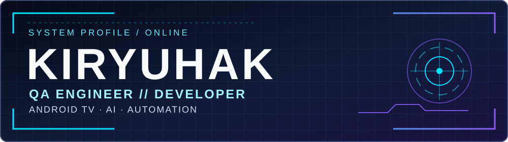

<div align="center">
  
</div>

```text
$ profile
name   Kirill
role   QA / Developer
build  VOX · LexiSync
loop   test → debug → ship
```

## 🧬 SYSTEM PROFILE

Меня зовут Кирилл. Я QA Engineer и разработчик. Создаю инструменты для Android TV и браузера, автоматизирую проверки и разбираюсь со сбоями, которые не исчезают после первого исправления.

`QA ENGINEERING` · `ANDROID TV` · `KOTLIN / JAVA` · `TYPESCRIPT` · `AI AUTOMATION` · `CI/CD`

<p align="center"></p>

## ◈ PROJECTS // Основные проекты

<table>
<tr><td valign="top">
<h3>01 / SMARTTUBE VOX</h3>
<p><code>STATUS: ACTIVE</code> &nbsp; <code>PLATFORM: ANDROID TV</code> &nbsp; <code>CORE: JAVA + KOTLIN</code></p>
<p>Неофициальный форк SmartTube для Android TV и Google TV со встроенным закадровым переводом Яндекса. Основа проекта — <a href="https://github.com/yuliskov/SmartTube">SmartTube</a>.</p>
<p><strong>RELEASED</strong> · Яндекс VOT и «Живой голос» · баланс громкости оригинала и перевода · управление с пульта · обновления внутри приложения.</p>
<p><strong>IN DEVELOPMENT</strong> · VOX 5: новые модули на Kotlin, запуск видео с внешних устройств и архитектура загрузки видео с оригинальной и переводной дорожками. Загрузка пока не выпущена.</p>
<p><a href="https://github.com/Kiryuhak/SmartTube-Vox">Код</a> &nbsp;•&nbsp; <a href="https://github.com/Kiryuhak/SmartTube-Vox/releases">Релизы и APK</a> &nbsp;•&nbsp; <a href="https://github.com/Kiryuhak/SmartTube-Vox/blob/main/LICENSE">Лицензия репозитория: MIT</a></p>
</td></tr>
<tr><td valign="top">
<h3>02 / LEXISYNC</h3>
<p><code>STATUS: ACTIVE</code> &nbsp; <code>PLATFORM: CHROME + FIREFOX</code> &nbsp; <code>CORE: TYPESCRIPT</code></p>
<p>Расширение для проверки и улучшения текста в браузере. Использует Mistral AI и Cloudflare Workers AI; быстрые локальные инструменты работают без отправки текста в облако.</p>
<p><strong>MODULES</strong> · орфография и стиль · перевод · OCR · автоматические тесты в Chromium и Firefox.</p>
<p><a href="https://github.com/Kiryuhak/LexiSync">Код</a> &nbsp;•&nbsp; <a href="https://github.com/Kiryuhak/LexiSync/releases">Релизы</a> &nbsp;•&nbsp; <a href="https://chromewebstore.google.com/detail/iacebnbpapcgjlplkeapekjeoljfdpgl">Chrome Web Store</a> &nbsp;•&nbsp; <a href="https://addons.mozilla.org/ru/firefox/addon/65facfa619b74330bdfa/">Firefox Add-ons</a></p>
</td></tr>
</table>

## ⚙️ TECH STACK

**CORE** · Android TV · Kotlin · Java · TypeScript · JavaScript<br/>


**QA** · Playwright · Vitest · ADB / logcat · API-тестирование

**INFRA** · Gradle · GitHub Actions · Node.js · Cloudflare<br/>


## 🧪 ENGINEERING MODE

- `TEST` · unit, integration, E2E, регрессия и проверки граничных условий.
- `DEBUG` · ADB, logcat, сетевые трассы и поиск причины сбоя.
- `SHIP` · CI/CD, релизы, OAuth-интеграции и устойчивые резервные сценарии.

## 🚧 ACTIVE DEVELOPMENT

- **SMARTTUBE VOX** · `VOX 5 IN DEVELOPMENT` · Kotlin-модули, DIAL-запуск, устойчивость перевода и проектирование загрузки/офлайн-медиа.
- **LEXISYNC** · `ACTIVE` · качество AI-проверки, переключение провайдеров при сбоях и кросс-браузерные тесты.

<p align="center"></p>

## 📡 SIGNAL / ACTIVITY

<p align="center"><a href="https://github.com/KiryuhaK"></a> <a href="https://github.com/KiryuhaK?tab=followers"></a> <a href="https://github.com/KiryuhaK?tab=repositories"></a></p>

Мои [публичные вклады](https://github.com/KiryuhaK?tab=overview) и выпуски [SmartTube VOX](https://github.com/Kiryuhak/SmartTube-Vox/releases) / [LexiSync](https://github.com/Kiryuhak/LexiSync/releases).

<picture>
  <source media="(prefers-color-scheme: dark)" srcset="https://raw.githubusercontent.com/Kiryuhak/KiryuhaK/output/github-contribution-grid-snake-dark.svg" />
  <source media="(prefers-color-scheme: light)" srcset="https://raw.githubusercontent.com/Kiryuhak/KiryuhaK/output/github-contribution-grid-snake.svg" />
  
</picture>

## 📡 CONNECTION

[GitHub @KiryuhaK](https://github.com/KiryuhaK) · Открыт к интересным задачам в QA, Android TV, автоматизации и AI-интеграциях.

<div align="center">

`SYSTEM STATUS: ONLINE`<br/>
`BUILD → TEST → DEBUG → SHIP`

</div>
