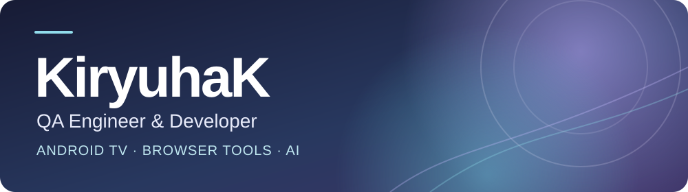

  

  
<strong>Привет, я Кирилл.</strong> Разрабатываю полезные инструменты и люблю разбираться в сложных ошибках.

  
<a href="https://github.com/Kiryuhak/SmartTube-Vox">SmartTube VOX</a> &nbsp;·&nbsp; <a href="https://github.com/Kiryuhak/LexiSync">LexiSync</a> &nbsp;·&nbsp; <a href="https://github.com/KiryuhaK?tab=repositories">Все проекты</a>

## Обо мне

Я QA Engineer и разработчик. Работаю с Android TV, браузерными расширениями, автоматизацией тестирования и AI-интеграциями. Для меня важны понятное поведение продукта, хорошая диагностика и надёжный выпуск обновлений.

## Избранные проекты

### 📺 SmartTube VOX

Неофициальная версия [SmartTube](https://github.com/yuliskov/SmartTube) для Android TV и Google TV со встроенным закадровым переводом Яндекса.

**Уже доступно:** Яндекс VOT и «Живой голос», настройка баланса оригинала и перевода, управление с пульта и обновления внутри приложения.

**В работе:** VOX 5 — новые модули на Kotlin, запуск видео с внешних устройств и проектирование загрузки с двумя аудиодорожками. Загрузка пока не выпущена.

[Репозиторий](https://github.com/Kiryuhak/SmartTube-Vox) · [Релизы и APK](https://github.com/Kiryuhak/SmartTube-Vox/releases) · [Лицензия MIT](https://github.com/Kiryuhak/SmartTube-Vox/blob/main/LICENSE)

### 🔤 LexiSync

Расширение для Chrome и Firefox: помогает исправлять и улучшать текст, переводить его и распознавать текст на изображениях. Поддерживает Mistral AI и Cloudflare Workers AI; часть быстрых действий выполняется локально.

**Под капотом:** TypeScript, OCR, тесты на Vitest и Playwright, переключение AI-провайдера при сбоях.

[Репозиторий](https://github.com/Kiryuhak/LexiSync) · [Релизы](https://github.com/Kiryuhak/LexiSync/releases) · [Chrome Web Store](https://chromewebstore.google.com/detail/iacebnbpapcgjlplkeapekjeoljfdpgl) · [Firefox Add-ons](https://addons.mozilla.org/ru/firefox/addon/65facfa619b74330bdfa/)

## Инструменты

   
  

- **Тестирование:** Vitest, Playwright, API-тесты и регрессия.
- **Диагностика:** ADB, logcat и сетевые трассы.
- **Разработка:** Android TV, браузерные расширения, OAuth и CI/CD.

## Сейчас в работе

- **SmartTube VOX:** стабильность перевода, Kotlin-модули и архитектура офлайн-медиа для VOX 5.
- **LexiSync:** качество AI-проверки, резервные сценарии и кросс-браузерные тесты.

## Активность

  

## Связаться

[GitHub @KiryuhaK](https://github.com/KiryuhaK) · Открыт к интересным задачам в QA, Android TV, автоматизации и AI-интеграциях.
